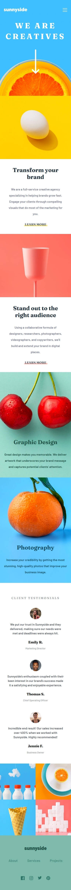
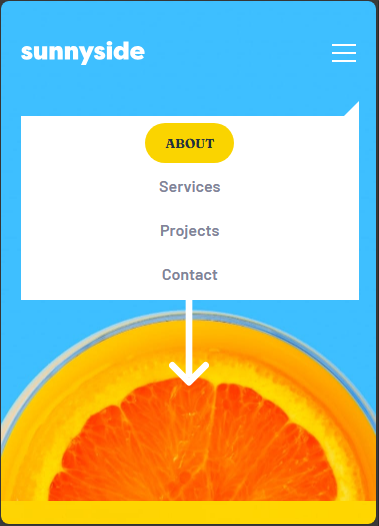
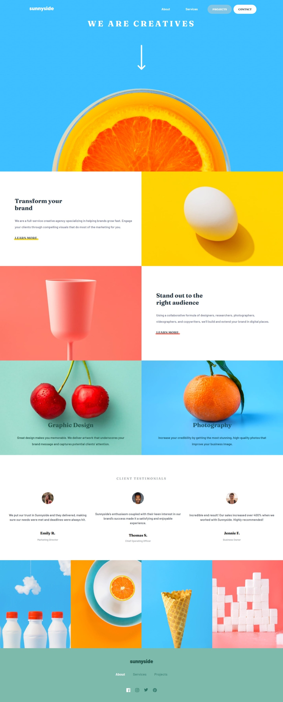

# Sunnyside agency landing page

This is a solution to the [sunnyside-agency-landing-page-main on Frontend Mentor](https://github.com/gillaercio/sunnyside-agency-landing-page-main). Frontend Mentor challenges help you improve your coding skills by building realistic projects

## Table of contents

- [Overview](#overview)
  - [Screenshot](#screenshot)
  - [Links](#links)
- [My process](#my-process)
  - [Built with](#built-with)
  - [What I learned](#what-i-learned)
  - [Continued development](#continued-development)
- [Author](#author)

## Overview

### Screenshot

These are my screenshots showing how the project turned out.

- Mobile design:



- Desktop design:


- Mobile menu:



- Active states:



### Links

- Solution URL: [My Solution](https://github.com/gillaercio/sunnyside-agency-landing-page-main)

## My process

### Built with

- Semantic HTML5 markup
- CSS custom properties
- Flexbox
- CSS Grid
- Mobile-first workflow
- JavaScript

### What I learned

I took advantage of this project to practice using **BEM** with HTML, **Reset CSS**, **Pseudo-elements** and  **Variables** with **CSS** and **DOM** with **JavaScript**:

BEM (Block Element Modifier)

```html
  <div class="container header__top">
    <a href="#" class="header__logo">
      
    </a>
    <button class="menu-toggle header__toggle" id="menu-toggle" aria-label="Open menu" aria-controls="site-nav" aria-expanded="false">
      
    </button>
    <nav class="header__nav" id="site-nav">
      <ul class="nav__list">
        <li class="nav__item"><a href="#">About</a></li>
        <li class="nav__item"><a href="#">Services</a></li>
        <li class="nav__item"><a href="#">Projects</a></li>
        <li class="nav__item nav__item--cta"><a href="#">Contact</a></li>
      </ul>
    </nav>
  </div>
```

Reset CSS

```css
*,
*::before,
*::after {
  margin: 0;
  padding: 0;
  box-sizing: border-box;
}
```

Pseudo-elements

```css
.header__nav::before {
  content: "";
  position: absolute;
  top: -15px;
  right: 0;
  border-left: 15px solid transparent;
  border-right: 15px solid var(--White);
  border-top: 15px solid transparent;
  border-bottom: 15px solid var(--White);
}
```

Variables

```css
  --Red-450: hsla(7, 99%, 70%, 0.500);
  --Yellow-500: hsl(51, 100%, 49%);
  --Green-550: hsl(166, 31%, 61%);
  --fraunces-menu: 900 1.3rem/120% var(--fraunces);
  --transition-default: 0.3s ease;
```

DOM

```js
const toggle = document.querySelector(".header__toggle");
const nav = document.querySelector(".header__nav");

toggle.addEventListener("click", ()=> {
  const isActive = nav.classList.toggle("active");
  toggle.setAttribute("aria-expanded", isActive);
})
```

### Continued development

I would like to improve the use of the **HTML**, **CSS** and **JavaScript**.

## Author

- Frontend Mentor - [@gillaercio](https://www.frontendmentor.io/profile/gillaercio)
- Github - [My Github](https://github.com/gillaercio)
- LinkedIn - [My LinkedIn](https://www.linkedin.com/in/gildman-la%C3%A9rcio/)